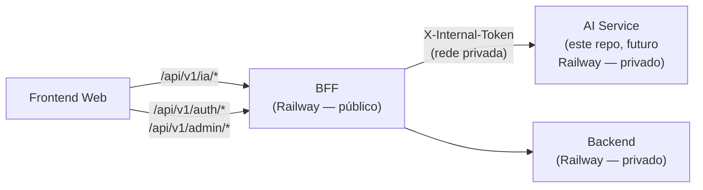

# AnatoQuizUp AI

> ⚠️ **Repositório em estado placeholder.** Reservado para os módulos de Inteligência Artificial do AnatoQuizUp. **Sem código nesta release** — o desenvolvimento está planejado para semestres futuros.

## O que será este serviço

O **AI Service** será responsável pelos três módulos de IA do produto:

1. **Geração de Questões por IA** — modelo treinado/ajustado com base no banco de questões existente (~600 questões validadas) que aprende o padrão dos professores e gera novas questões. Toda questão gerada passa por aprovação docente antes de entrar no banco oficial.
2. **Geração de Imagens Anatômicas por IA** — geração de imagens contextualizadas para acompanhar questões.
3. **Chatbot Educacional** — chatbot treinado com o banco de questões + livros digitais do acervo da UnB sobre anatomia.

## Como o AnatoQuizUp consumirá o AI

O serviço de AI **não será chamado diretamente** pelo Frontend. Toda chamada passa pelo **BFF** (`fga-eps-mds/2026-1-AnatoQuizUp-BFF`), que roteia `/api/v1/ia/*` para este serviço.

Enquanto o serviço estiver vazio, o BFF responde **`503 IA_INDISPONIVEL`** em qualquer chamada `/api/v1/ia/*`.

## Stack sugerida (a confirmar quando o desenvolvimento começar)

| Componente | Sugestão | Justificativa |
|---|---|---|
| Linguagem | Python 3.11+ | Ecossistema dominante para LLMs, embeddings, geração de imagem |
| Framework HTTP | FastAPI | Async, OpenAPI nativo, tipagem com Pydantic |
| LLM | A definir (Claude / GPT / open source) | Depende de custo, latência e qualidade nos benchmarks com questões da UnB |
| Embeddings/Retrieval | A definir (pgvector / Pinecone / Chroma) | Depende da decisão de banco |
| Geração de imagem | A definir (Stable Diffusion / DALL-E / Imagen) | Depende de custo e qualidade |
| Banco | A definir (Postgres com pgvector? Banco separado?) | Decisão arquitetural pendente |

## Contratos esperados (rascunho — pode mudar)

Quando o serviço subir, os endpoints **internos** (consumidos pelo BFF) terão prefixo `/api/v1/`. Exemplos provisórios:

- `POST /api/v1/questoes/gerar` — gera N questões com base em parâmetros (tema, dificuldade, formato)
- `POST /api/v1/imagens/gerar` — gera imagem anatômica a partir de prompt
- `POST /api/v1/chat/mensagens` — envia mensagem ao chatbot, retorna resposta com citações de fonte

Todos exigem header `X-Internal-Token` igual ao do BFF (mesmo padrão do Backend).

## Documentação

- [Visão geral da arquitetura](https://fga-eps-mds.github.io/2026-1-AnatoQuizUp-Doc/arquitetura/visao_geral/)
